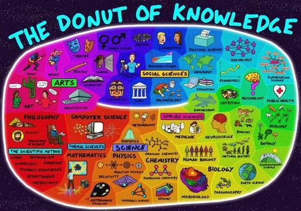

### Knowledge

* 哲学
* [文学](文学)
* [语言&文化](语言&文化)
* [历史](历史)
* 音乐 
* Modern [Science](https://www.wikiwand.com/en/Science) 现代科学：人类探索、不断追求真理的过程
  * Natural Science 自然科学
    * 生物学
    * [化学](化学)
    * [物理](物理)
    * 地球科学
      * 地质学
      * 地理学
    * 天文学
  * Social Science 社会科学：研究个人和社会
    * 经济学 
    * 心理学
    * 社会学
  * Formal Science 形式科学：研究抽象概念（刑事科学是否真正构成一门科学还有分歧，因为它们不依赖经验证据）
    * 逻辑
    * [数学](数学)
    * [理论计算机科学](https://github.com/MingxiaGuo/Computer-Science)
  * 应用科学：将现有科学知识应用于工程和医学等实际目的的学科

## Website

* [Dominic Walliman](https://dominicwalliman.com/) Author of 'The map of ....'

## The Donut of Knowledge

[Youtube video](https://www.youtube.com/watch?v=ohyai6GIRZg)     [bilibili video](https://www.bilibili.com/video/av47024475?from=search&seid=10402188973178797287)

科学的终极目标是设法分析及解释宇宙万物的运作方式，其中包括许多大课题。像是：宇宙从哪来？它究竟是怎么构成的？这些东西是如何运作和互动的？以及人类及其智慧是如何产生，并以此智慧思想及探讨它的存在？这些琐碎的事情自从有人站在星空下抬头仰望星空。唉？人们一直在问这些问题。

科学的形成可以追溯到古代**美索不达米亚人**和**埃及人**，但是科学理论却源于**哲学**，从希腊哲学家**亚里士多德**起。亚里士多德是第一位思考如何实际落实科学的人。科学方法经过岁月的洗礼已经逐渐完善，而现在被称为**科学哲理**(Philosophy of Science)。

科学的核心是其**科学方法**(The Scientific Method)，其中包含**逻辑思维**(Logic)，**理性主义**(rationalism)，**经验主义**(Empiricism)，**收集证据**(Evidence)，**可验证的假设**(Testable Hypotheses)，**客观性**(Objectivists)和**可还原性**(reductionism)。这是科学的‘工具包’，帮助我们处理从宇宙中获得的信息，弄清楚什么是真实的或虚伪的。

**数学**和计算机科学在技术层面不属于科学，因为他们不研究世界上的自然现象，但它们与科学非常接近并且是科学家非常有利的工具。

数学是**物理学**的运作核心，数学是神秘的及完善的描述宇宙。

计算机被用于所有科学领域，因为做科学需要一个大脑，而计算机是一个神奇的工具，可辅助我们的大脑。

科学的核心由**物理学**，**化学**和生物学组成，且其中也包含了许多的学科。我没有足够的空间来包括所有的学科， 但我已经完成了深入的图表。如果你愿意，可以搜索频道了解更多。

以宏观来看，科学方法有趣的在不同学科发生变化。通过**还原论**，物理学在对于宇宙的理解方面取得了巨大的进步。经由将物质破碎至最小化以逐一了解它们。

但当你向化学或生物学迈进时，还原论变得越来越难落实，因为这些科目处理着更复杂的系统。如果你想研究生物中的某一部分，那单个物体的性质可能强烈的与它联系的一切相连。一旦分离，你便不能再研究其单件的功能。因为把它们从其关联中移除实际上将改变其表现性质，并影响对其的研究。

所以事事是相连且复杂的，像是：在你的DNA中你的基因如何表现而产生了你，或是你的神经元和神经递质是如何结合地创造着您现有的独特体验。这些系统涌出大量且复杂的关系，所以想捕获将这些复杂性都融入一个模型、一个方程式、一个解决方案、一个理论中是非常困难的。

事实上，随着我们越是深入，我们将越远离物理的基础，整个科学方法开始分裂。你可以从营养学及心理学等领域看到这一点，越来越多研究结果之一曾经报道的食用饱和脂肪酸将造成高胆固醇，或为何许多著名心理学研究的结果难以被再验证，像意志力是有限资源，这样的研究。但我认为这些错误是可以被理解的。因为想要应用科学理论来解释，为什么人们会这么做事情，是一件非常艰难的事情。因为人们是复杂的。且事实上，世上有一种说法是：人脑是我们知道的宇宙中最复杂的系统！所以，当你把这些东西放在一起时，像是社会学，它就变的疯狂。

这把我们带到了**社会科学**。从这起科学就不再那么科学。这些学术通常含有混合着科学实践和人文学科，就像**考古学**应用着物理学中的科学技术来检测地底结构，或碳元素放射性周期检查物体年代，但然后用以解释那个时代的人类及其生活，结果的解析变得更为主观。或者在**经济学**或**政治学**等领域人们可以应用严格的统计学进行数据处理，但然后的解释者必须经由人脑处理，其本质上更为主观。

所以证明其经济预测时不科学的事实，是它无法预测未来。所以在经济学中似乎我们无法预测经济衰退即将发生，或者比特币明天会如何。然而在物理学，如果我扔一颗球，我可以形容非常好的形容这颗球的“未来”。

请注意，我不是在说**主观性**必然是一件坏事，如果今天你的研究主题间有着某种非常复杂的关系，并且你采取的科学方法已到了极限，你还能做什么，主观性的解析就是你所剩下的选择。但是如果这些主观的分析没被识别或标签，而使得人们认为它们的分析是客观的，这便会造成问题，而这确实发生了。

但这也鼓励人们创新科学方法，并提出新的技术处理这些系统问题。历史上的一个例子是随机抽样对照性的药物试验，为了真实的证明药物是否有效，以及为了解近期社会科学研究的不可还原性危机，科学家们证实图创造新的技术和方法来处理这些复杂的系统问题。这是一个非常艰巨的挑战，但那也是进步的需求。

但如果你想了解某件世界现象的真相，科学方法仍然是我们拥有的最佳方法。

但现在让我们继续我们的旅程并放下令我们沉重的科学负担，进入艺术，一个纯粹主观性的领域。这是好艺术吗。我喜欢它，好的，它与科学共享的一项是探索，突破曾经拥有的极限，曾经完成的或想过的。他们通过书籍、影视、音乐、艺术作品、探索个人状态，并一直努力的寻找新方法来反映活着的意义，一个有情感的人及一个具有创造力的大脑。我认为这也是我们不能用科学来解释的因为这样，他们便会失去魅力。那无形的本质便是使得他们如此有趣的元素。

一些最持久的艺术已经冲击了人类的最大的问题就像是什么是人？人为什么在这里？及在此人们应该做些什么？这些与我们科学的起点非常相似，并把我们带入事情的另一边，哲学方面思考。

在此，我有些过界了，这张图不是科学蓝图，而是人类智力发展的蓝图。它甚至不是一张蓝图，而是一个宇宙智慧的甜甜圈（The Donut of Knowledge）。 

