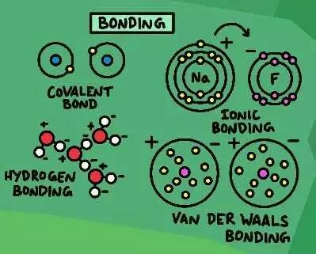
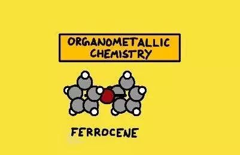

# The Map of Chemistry

[bilibili video](https://www.bilibili.com/video/av63727789?p=5)

继《物理学地图》和《数学地图》后， Dominic Walliman又制作了一张《化学地图》。这张地图的目的是带领大家认识化学，并了解化学是如何与生活中的一切紧密联系在一起的。尽管该地图系列并没有全面地包含所有的话题，也仅限于最简单地描述，但其目的是让读者大略的了解各学科的主要分支。本文的描述也将锁定在这张图所包含的内容之上。

在宇宙诞生之初，由于温度太高，无法产生中性的原子（甚至是原子核），因为它们会立即在对撞中被击碎。但随着时间流逝，宇宙膨胀的越来越大，并且温度慢慢冷却到可以产生稳定的原子核，就会得到~75%的氢、~25%的氦以及0.0000001%的锂，除此外没有其它的元素。后来，当恒星开始诞生时，一切就都改变了。

在宇宙诞生后的~138亿年后，在一个蓝色的星球上，一群具备高等智慧的文明得知了恒星之所以会发光的秘密。在恒星的核心中，氢和氦不断地聚变提供了源源不断的能量。这些能源总有耗尽的一天，恒星最终会在一场绚丽的爆炸中结束自己的生命。恒星诞生-死亡-诞生…在这个循环往复的过程中，产生了今天我们知道的所有元素。这便是**化学**的来源。

这些元素会聚集形成各种各样不同形式的分子，这些分子更是意想不到的以各种复杂的方式结合在一起。而**化学则是一门研究这些物质的性质、组成、结构、变化规律、以及相互作用的基础自然科学。从简单的原子，到复杂的生物分子，都是化学的研究对象。**

## 1 起源

当我们提起化学家的时候，脑海中闪过的画面总是一群穿着白衣大褂的人在实验室中捣鼓着五颜六色的奇异液体。但事实上，我们每个人都是化学家。人类在很早的时候就对化学产生了浓厚的兴趣。从**火的化学反应**开始，人类就一直运用它来发展其它的化学技术，比如**煮东西**、**制造金属**和**玻璃**等等。之后，文明的发展其实都是基于化学的进步，比如**金属加工**、**化肥生产**、**制造新的材料**和**药物**等。

化学是生活中的一部分，可惜的是大多数人都没有意识到这一点。这张地图的目的正是带领大家认识化学，并了解化学是如何与生活中的一切紧密联系在一起的。在进入化学领域之前，我们需要掌握一些基本的化学规则。

## 2 化学规则

### 2.1 Matter 物质

△ 原子和元素周期表

既然化学是一门研究物质的学科，那么我们首先就得知道物质是由什么构成的。我们生活中接触到的一切物体都是由**原子**构成的。而在过去的100年中，科学家才逐渐搞清楚原子的真实面目。原子的核心是原子核，由质子和中子组成（它们又是由更小的夸克构成），绕着原子核运行的是电子。电子的数目和行为对化学反应很重要。**元素周期表**上的每个化学元素都代表了不同的原子，同一列的元素具有相似的化学性质。

### 2.2 Chemical Compound 化合物

△ 像水、二氧化碳等等都是化合物

不同的原子之间会以固定的质量比结合形成不同的**分子**，比如一个碳原子结合两个氧原子会形成二氧化碳等。不同类型的分子被称为化合物。

化合物的性质通常和构成它们的元素非常不同，像由可助燃的氧和可燃烧的氢组成的水，即不会燃烧也不会助燃。化合物并不只是由单一的分子构成，有许多固体（比如金属或盐）都具有**晶体**结构，是由重复的多个原子构成，称为**单位晶格**。如果有许多不同的物质聚在一起就会形成**混合物**，比如你周围的空气或一个蛋糕。

### 2.3 Bonding 键

△ 键包括了共价键、离子键、氢键和范德华键

但问题是，原子是如何结合在一起的？这就需要知道**键**的概念。原子之间会以不同的方式连接在一起，它们通过偷窃或共享电子来减少结合能，或者将它们重新排列成不同的结构。科学中的一个通用规则是所有东西总是试图最小化它们的能量，而键正是原子达到这个目的的一种方式。

### 2.4 Energy 能量

△ 木柴和氧气的反应也是解释能量的一个例子，右边为催化剂的作用。

理解**能量**在化学物质中是如何传播的是了解一个反应究竟会不会发生的关键。例如红磷燃烧，红磷有的时候在空气中会燃烧，是红磷和氧气反应释放出了能量，我们看到的火焰（鬼火）就是能量的表现形式。还有一个例子能够彰显能量的重要性，即通过引进**催化剂**，两个化合物能够加速反应。例如过氧化氢在一般情况中会缓慢分解成水和氧气，但分解速度极其慢，如果加入碘化钾（催化剂）就会加快其反应速度。

### 2.5  Phases 相

△ 固相、液相、气相

能量也决定了化合物的形态，比如**固态**、**液态**或**气态**。它们会以何种形态出现取决于它们所处的温度和所受的压力。为了说明这三种状态，以及温度和压力的重要性，我们以水为例。在生活中，我们会发现水在0度时会凝结成冰，在100度烧开时变成水蒸气。冰、水、水蒸气分别是水的固、液、气相。在高原上，气压比正常情况要低，可能水在70多度就能烧开，这就是压力改变了水到水蒸气的相转变温度。

另一种非常有趣的物质形态被称为**等离子体**。在这种状态下，气体中的原子会拥有比正常更多或更少的电子，从而形成阴离子或阳离子。生活中常见的霓虹灯的光线就来源于内部的等离子体。

### 2.6 Reactions 化学反应

△ 反应有多种类型，比如合成、分解、置换反应等。热力学决定了反应能否发生，动力学决定了反应的快慢。

**化学反应**是化学的核心：哪种化合物之间会相互反应，为什么它们会反应，以及反应后会剩下什么。有许多不同方式的反应，可以用不同的方法来分类。所有这些反应都是由一系列基本规则（即化学定律）所支配。最基本的规则是**质量和能量守恒**，意味着没有任何物质或能量能够在化学反应中被制造或毁灭，它们只是会转变成不同的形态。

**动力学**研究的是反应发生的快慢，并决定了反应率是多少。在一个反应中，电子从一个反应物转换到另一个的过程叫**氧化还原反应**。氧化意味着失去一个电子，而还原意味着得到一个电子，它们必须一起发生。

物质的另一个重要性质就是**pH值**，代表了酸碱程度（如pH=0的盐酸，pH=7的纯水，pH=14的氢氧化钠）。思考它们的其中一种方式是，在化学反应中，酸性物质会放弃一个氢离子，而碱性物质会接纳一个氢离子。

在同一条件下，正反应方向和逆反应方向均能进行的化学反应称为**可逆反应**。在一个封闭的系统中，这意味着两种物质之间可以变来变去。当正向反应的速率与逆向反应的速率达到平衡时，可逆反应就会达到化学平衡。

上面所提到的都是化学的基础。化学研究则是将这些规则应用在不同的化学系统中。接下来我们将要进入不同的化学领域（这些领域都有各自延伸的子学科和应用化学领域）。

## 3 化学领域

### 3.1  Theoretical Chemistry 理论化学

理论化学专注于解释原子和分子的结构，以及利用数学方法来描述它们是如何相互作用的。它跟**理论物理**和**量子化学**有着紧密的联系，并经常利用**计算化学**中的技巧来模拟原子、分子和反应。但是，要模拟比单个氢原子更复杂的系统的量子行为是非常困难的。因此，许多计算机科学中最先进的技巧会被用来模拟分子，以及它们之间是如何作用的。事实上，这是未来量子计算机中最令人期待的一个应用之一，因为量子计算机可以直接模拟化学系统，并且能够帮助发现新奇的材料和药物等等。

### 3.2 Physical Chemistry 物理化学

物理化学从物理学角度来研究化学系统，比如**能量**、**力**、**时间**、**运动**、**热力学**、**量子性质**等，可谓是近代化学原理的根基。物理化学有许多的子领域，比如研究电子的性质的**电化学**，这对研究更好的电池或材料科学很重要。**材料科学**试图研发具有新性质的材料，比如极限强度、耐久性或自我修复。同时，发展新材料也有助于制造核聚变反应堆。

### 3.3 Analytical Chemistry 分析化学

分析化学就好比是侦探工作，当你获得某样物质时，需要采用定性和定量分析来确定物质的组分，以及测定物质中各组分的含量。化学家发展了不同的方法来探索和测量不同材料的不同性质。传统的方法涉及到**湿化学方法**，比如根据不同的温度，**蒸馏法**会将不同的化合物分离。也有许多现代技巧，比如**色谱法**，不同的化合物会以不同的速度通过溶液，因此会分离。或者许多不同类型的**光谱学**，可以通过照射光来探测材料；或**质谱法**，当材料通过电场或磁场时，由于质量不同就会分离。

3.4 Inorganic Chemistry 无机化学

大部分被研究的无机化合物都是**人造**的，其主要的动力来自找到具有新性质的化学制品，可以被应用在化学工业以及其它领域。事实上，化学家在这方面的努力大多数都被应用在生活之中，比如**医药**，**农业**、特别的**液体**（洗涤剂或乳化剂）、特别**涂层**、**色素**、**染料**等都被应用在工业用途上。在化工生产中，催化剂非常重要，因为它们会加速其它的化学反应。

### 3.4 Organic Chemistry 有机化学

有机化学主要研究**生命分子**的结构和行为，这些分子通常由一套不同的原子构成，比如**碳**、**氢**、**氧**和**氮**等。有机化学家也会制造一些有用的有机化合物。有机分子全都包含碳，**碳氢键**也是有机化学中最常见的结构。有机化学在工业上有诸多应用：**化肥**、**杀虫剂**、**润滑剂**、**聚合物**和**塑料**等。日常生活中我们会用到的有**香水**、**香料**和**防腐剂**，以及制药工业中的**药品**。

### 3.5 Organometallic Chemistry 有机金属化学

△ 有机金属化合物：二茂铁

有机化学和无机化学之间并没有绝对的区别，它们之间有很多交集，比如**有机金属化学**二者之间交叉的一门分支。有机金属化学研究含有金属和碳原子键结的**有机金属化合物**，其化学反应、合成等各种问题。有机金属化合物实际中会应用在化学计量反应及催化过程中。

### 3.6 Biochemistry 生物化学

该领域是研究生物体中的化学进程的一门学科。生物化学研究的成分可以是无机的，比如水或矿物，但也研究最大和最复杂的分子，比如**蛋白质**、**脂肪**和**DNA**。

在该领域的另一边跟**分子生物学**有紧密的联系，它探究的是生命是如何从细胞中的化学过程中出现的细节。在生物化学中，有四种主要的分子类别，叫做**生物分子**：

* **碳水化合物**被用来结构和储存能量；

* **脂类**，是脂肪酸与醇作用脱水缩合生成的酯及其衍生物的统称，被应用于美容、食品加工和纳米技术等；

* **蛋白质**是大型生物分子，由氨基酸构成，在身体中有许多不同的功能；

* 以及**核酸**，用来传递基因信息。

生物化学的研究对**医药**有着巨大的影响，有助于理解传染和基因疾病，改善器官和组织移植技术，运用临床诊断来检查我们身体的状况，帮助我们理解营养学：研究在我们身体中维他命和矿物的功能。同时，生物化学对**农业**也很重要，研究土壤、化肥和害虫防治。以及其它许多运用。

这便是化学世界全部：

研究化学最迷人的地方在于，如此复杂的世界都是基于一系列简单的化学反应。从最简单的原子，到生命必备的细胞，化学带领我们更好的理解这个世界。

