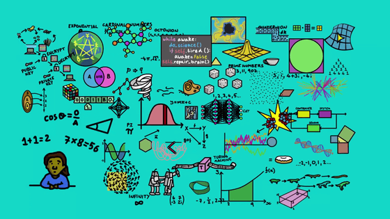

# The map of mathmetics

> 数学确属美妙的杰作，宛如画家或诗人的创作一样——是思想的综合；如同颜色或词汇的综合一样，应当具有内在的和谐一致。对于数学概念来说，美是她的第一个试金石；世界上不存在畸形丑陋的数学。——G.H.Hardy

这张数学地图，概括了所有的数学分支。

[bilibili video](https://www.bilibili.com/video/av9208524?from=search&seid=9988317757046210559)

## 1 数学始于计数

故事还得从头开始。数学始于**计数**。事实上，计数不仅仅只是人类的特性，其它的动物（比如鸟、猴子等）也有计数的能力。人类在木头、骨头或石头上的计数符号从史前时代就开始被使用了。在石器时代的文化中，他们会使用计数符号进行赌博、私人服务和交易。

最近的几千年里，在不同的国度，数学都得到了发展。古埃及人写下了第一个方程。古希腊人则在许多方面都有贡献，比如几何和数秘术。中国数学家早就有了负数的概念。“0”这个数字则在印度首次被使用。接着在波斯伊斯兰教的黄金时期，数学家又跨越了一大步，书写了第一部代数学的书籍。在文艺复兴时期，数学与科学则共同欣荣发展。

## 2 现代数学

当然，以上提到的仅仅是数学历史中的冰山一角，我不打算在这里提及更多。我的主要目标是要带你们进入现代数学的分支。

现代数学可以大致被分为两个领域：**纯粹数学**（研究数学本身）和**应用数学**（用以解决更实际的问题）。但我们要记住的是，它们之间其实有着紧密的关联。如果能的话，这张地图更应该是一张网络，连接着每个相关的分支。但我们现在只能尽量把它呈现在二维的平面上。

△ 左边为纯粹数学，右边为应用数学。

事实上，从历史中我们会发现，有许多数学家一开始只是出于好奇以及对美的追求去研究数学，然后发展了一系列美丽而又有趣的数学分支，但对于真实世界却一点用处都没有。令人惊喜的是，比如在100年后，当有些科学家正在试图解决物理学或计算机科学最前沿的问题时发现，他们所需要的数学其实早就在纯粹数学里被发展出来了。这样的例子不胜枚举，比如广义相对论的发展依赖于黎曼度规；弦理论则需要卡-丘空间等等。这些抽象的概念最终被应用在其它的科学领域中是非常令人欣喜的一件事。

先抛开纯粹数学是否有一天能被应用在现实中去，其实研究纯粹数学本身也是非常有价值的事。如果你问一位数学家为什么要研究纯粹数学，我想很多人的答案会简洁到只有一个字，那就是：美！

> 他看到了批评或者审查人类理性的迫切需要，也就是说，需要一场审判，以确保理性的公正诉求并斥退其无根据诉求，换言之，这场审判将调查普遍知识和必然知识之可能与不可能，调查知识的来源，范围和界限……抱着这样的目的，康德写下了三大批评：《纯粹理性批评》，审查理论理性或科学；《实践理性批评》，审查实践理性或道德；还有《判断力批评》，审查我们的审美或目的论判断，或是艺术和自然中的目的性。
>
> ——剃利《西方哲学史》

首先进入纯粹数学的领域

### 2.1 纯粹数学

纯粹数学主要包括四个部分：数字系统、结构、空间和变化。

### 2.1.1 数字系统

数字系统的研究起源于数，一开始为熟悉的**自然数**（1、2、3...）及**整数**（…-2、-1、0、1、2...）与被描述在算术内的自然数及整数的算术运算（＋－× ÷ ）。当数系进一步发展时，整数被视为**有理数**（-7、1/2、2.32...）的子集，而有理数则包含于**实数**（-4π、e、√2...）中。实数则可以进一步被广义化为**复数**（4+3i、-4i...）。除此外，还有其它一系列的数（比如**四元数**、**八元数**和**基数**等）。还有一些数深受数学家的喜爱，比如**π**、**e**和**质数**（1，3，11...）。

刚才提到的这些数字都有一些有意思的性质，例如，尽管实数和整数都有无限多，但实数要比整数多。所以有一些无限实际要比另一些大。

### 2.1.2 结构

对结构的研究起始于将数字以变量的形式代入方程（y=mx+c）。如何解这些方程的规则包含在**代数**之中。在这个分支中，还有矢量和矩阵，它们都是多维数，而它们之间的联系于**线性代数**中被研究。

在这个分支内，有一个被誉为“最纯”的数学领域，那就是**数论**。数论专注于研究在“数字系统”中提到的所有数的特征，比如质数的性质（质数产生了很多非专业人士也能理解而又悬而未解的问题，如哥德巴赫猜想，孪生质数猜想等）。

另一方面，**组合数学**是一门研究可数或离散对象的数学分支，比如树、图论等，一些著名的问题包括地图着色问题、船夫过河问题等等。**群论**则是研究名为群的代数结构，一个熟悉的例子就是魔方，是一个置换群。**序理论**是研究捕获数学排序的直觉概念的各种二元关系的数学分支，比如哈斯图，是用来表示有限偏序集的一种数学图标。

### 2.1.3 空间

纯粹数学的另一个部分是研究形状和它们在空间中的行为。空间的研究源自于**几何**——尤其是欧几里得几何。**三角学**则结合了空间及数，且包含有著名的勾股定理。还有一些比较有趣的领域，比如**分形**，它是一种具有尺度不变性的数学模式，意思是说你无论你怎么放大它们看起来都是一样的。

在其许多分支中，**拓扑学**可能是20世纪数学中有着最大进展的领域。拓扑学研究的是空间的不同性质，你可以连续不断地将它们变形，但不能将它们撕裂或粘合。例如，无论你对莫比乌斯带做什么，它永远只有一个面和一个边界。在拓扑学里，咖啡杯和甜甜圈是一样的东西。拓扑学包含了存在已久的庞加莱猜想（2006年由数学家格里戈里·佩雷尔曼证明）以及颇有争议的四色定理（1976年由计算机证明）。

**测度论**是一种给空间或集分配数值的数学分支，它将数和空间联系起来。最后，**微分几何**是非常重要的一个数学分支，它研究在弯曲表面上的形状的性质，比如三角形在弯曲的表面中内角和跟在欧式空间中的不一样。

### 2.1.4 变化

了解及描述变化在自然科学里是一个普遍的议题，而**微积分**更加使研究变化的有力工具。函数诞生于此，作为描述一变化的量的核心概念。微积分是研究极限、微分学（函数的梯度的行为）、积分学（函数下的面积）和无穷级数的一个分支。而**向量分析**关注的则是向量场的微分和积分。

除此外，还有一系列其它的研究方向。**动力系统**描述的是系统如何随着时间流逝从一个状态演化到另一个状态，比如流体流动或任何有反馈环路的东西（如生态系统）。**混沌理论**则是对系统的既不可预测而又是决定的行为作明确的描述，它对于初始条件非常敏感，比如著名的蝴蝶效应。最后是**复分析**，对于实数及实变函数的严格研究为实分析，而复分析则为复数的等价领域。数学中最大的未解问题之一——黎曼猜想便是以复分析来描述的。

以上这些便是纯粹数学的各个分支。

## 2.2 应用数学

接下来我们进入应用数学的领域。应用数学的主旨在于将抽象的数学工具运用在解答科学、工程、商业及其他领域上的现实问题。

△ 数学被广泛地应用在各个科学领域。

> 应用数学是物质的短暂情人
>
> 纯数学是诗与远方的忠诚儿子

我们从**物理学**开始。基本上在纯粹数学提到的所有分支都多多少少的被应用于物理学上。数学和理论物理跟纯粹数学的关系是密不可分的。许多数学理论是在物理问题的基础上发展起来的；也有很多数学方法和工具通常只在物理学中找到实际应用。例如，微分方程被应用在经典力学和量子力学；场论被应用在电磁场、引力场和规范场；群论和表示论别应用在粒子物理学中。

除了物理外，数学也被应用在其它的自然科学上，特别是在**数学化学**和**生物数学**上。在数学化学中，数学模型通常被用以模拟分子；拓扑化学也是一个热门的研究领域（2016年的诺贝尔化学奖就跟拓扑有关）。数学也大量应用在生物学中，如由于基因学的发展，生物学家采集到的大量数据必须通过解析方法加以处理；演化生物学和生态学都大量使用数学理论等等。

数学也被大量应用在**工程学**上，自古埃及和巴比伦时期，数学就被大量应用在建筑上。非常复杂的电路系统，比如在飞机或电网中，就利用了动力系统的方法，叫控制理论。

（这里推荐一本Mary Boas写的教材《Mathematical Methods in the Physical Sciences》，对于那些本科选择物理、化学和工程专业的学生，这本书可以快速的帮你们掌握所需要的数学知识。）

当一些数学太过于复杂我们无法有效地解决时，我们就会用到**数值分析**，它也包含了对计算中舍入误差或其它来源的误差之研究。例如，如果你把一个圆圈放进一个正方形中，并向它扔许多的飞镖，接着比较飞镖在圆圈和正方形的数量，你就可以得到 π 的近似值。但在现实中，数值分析通常会使用大型计算机来实现。

**博弈论**专注于思考游戏中的个体的预测行为和实际行为，并研究它们的优化策略。主要研究公式化了的激励结构（游戏）间的相互作用。其中一个代表性的应用例子是囚徒困境。博弈论在经济学、心理学、生物学、国际关系、政治学等其它学科都有广泛的应用。

**概率论**是集中研究概率及随机现象的数学分支，最简单的随机事件为扔硬币、抽扑克或掷骰子。应用数学中的一个重要领域为**统计学**，它利用概率论为其工具并允许对含有机会成分的现象进行描述、分析与预测。大部分的实验、调查及观察研究都依赖于统计分析。因此被广泛地应用在各门学科，从自然科学、社会科学到人文学科。特别是在金融行业，通过统计分析以获取最大的利益。

跟最大化利益相关的是**最优化**，你试图计算的是在一系列不同选择或限制下的最佳选择，也就是找到一个函数的最高或最低点。最优化问题是人类的第二天性，我们一直在都在进行最优化选择，比如试图最优化我们的快乐程度，购买的时候想要物有所值等等。

另一个领域跟纯数学有非常深的联系，那就是**计算机科学**。计算机科学的规则事实上是从纯数学中推导出来的。机器学习是实现人工智能的一个途径，即以机器学习为手段解决人工智能中的问题。机器学习是一门多领域的交叉学科，利用了数学的许多领域，比如线性代数、最优化、动力系统和概率论等等。

最后，**密码术**也是非常重要且实用的一个数学分支，应用到了纯粹数学研究，比如组合数学和数论等。

现在我们已经概括了纯粹数学和应用数学的主要部分。但是，还没有结束，我们不能够忽略数学的基础。

## 2.3 数学基础

现在我们已经概括了纯粹数学和应用数学的主要部分。但是，还没有结束，我们不能够忽略数学的基础。

> 1 起初,高斯定义集合.
>
> 2 集合的元素空虚混沌，渊面黑暗；高斯的思维运行在直觉上。
>
> 3 高斯说：“要有公理”，就有了9条公理,组成了公理天团,拯救面临危机的数学.
>
> 4 高斯看元素是好的，就把一个元素定义为"1"。
>
> 5 高斯定义0为“1的前驱"，定义2为“1的后继”。有前驱,有后继,这是自然数.
>
> 6 高斯说:“集合元素之间要有运算,构成一个群."
>
> 7 高斯就规定了结合律,单位元,逆元,群结构就这样成了。
>
> 8 高斯定义负数为“自然数的逆”。验证了自然数满足运算性质,验证了结合律,是第二步.
>
> 9 高斯说:"整数群满足交换律,可以定义第二种运算.”环就这样成了。
>
> 10 高斯称第一种运算为“加”，称第二种为“乘”.高斯看着是好的.
>
> 11 高斯说:“整数环要扩展出分式域,让每个非零元素都可逆”有理数就这样成了。
>
> 12 于是自然地定义了有理数的加,通分后整数加;并定义了有理数的乘,分子分母分别整数乘;元素之间有大小顺序.高斯看着是好的。
>
> 13 有乘法逆,有全序,是第三步.
>
> 14 高斯说:“有理数要可以构成柯西列,可以完备化，
>
> 15 并要定义等价类,区分极限不同的柯西列.”实数就这样成了。
>
> 16 于是高斯定义了两个运算,实数的加,实数的乘,又造减和除，
>
> 17 就把这些验证是良定义,放在实数域上.
>
> 18 定义数的极限,验证性质.高斯看着是好的.
>
> 19 有实数,有极限,是第四步.
>
> 20 高斯说:“任何的多项式,也是要按照代数基本定理,具有一个零点,N次的多项式,应该有N个零点.”
>
> 21 高斯就对实数域进行了一次代数扩张;又造出虚单位,兼容实数的运算.高斯看着是好的。
>
> 22 高斯就赞美这一切,说:“我搞的这个代数系统啊,excellent。”
>
> 23 有虚单位,有代数完备,是第五步.
>
> 24 高斯说:“一个集合应该有这样的子集族,对集合运算封闭"sigma域就这样成了。
>
> 25 于是高斯让每个子集,对应一个非负实数;满足单调性和可数可加.高斯看着是好的。
>
> 26 高斯说:“我们要让每个可积的函数,按着勒贝格的办法,使他们对应一个实数,简单的,非负的,直到所有的，定义在一切可测函数上.”
>
> 27 高斯就照着实轴上积分的样子,造出了可测函数的积分.
>
> 28 高斯就赐福给他们,又对他们说:“有了可测函数积分,就可以定义符号测度,从而定义导数”
>
> 29 高斯说:“看哪,我将所有基础概念都定义了出来.
>
> 30 至于多重积分,复积分,算子值积分,不定积分,全微分,都留做习题,请读者自行完成.”事就这样成了。
>
> 31 高斯看着一切所造的都甚好.有深度,有逼格,是第六步.

数学的基础试图理解数学本身的性质，并且追问所有数学规则的基础是什么。是否存在着一套称为公理的完整的**基本规则**？我们要如何证明它是否自洽？**数理逻辑**、**集合论**和**范畴论**就试图回答这个问题。在数理逻辑中有一个非常著名的成果叫做哥德尔不完备定理，对大多数人来说，数学并没有一套完整和自洽的公理，意味着它们都是由我们人类创造的。这听起来很奇怪，因为数学如此完美的解释了宇宙中的许多事物。为什么我们会认为由人类创造的东西可以做到如此地步？这是一个非常深奥的谜题。

我们还有**计算理论**，它专注于研究不同的计算模型，基于这些模型如何能够有效地解决问题。它包含了复杂性理论，其中P/NP问题是该领域中至今没有解决的问题。

现在，我们有了一张通往数学世界的完整地图：

△ 数学地图。（图片来源：Dominic Walliman）

数学是一个非常抽象和美妙的世界，如果要用一句话形容它的重要性，那么我会选择伽利略曾经说过的：“如果一个人不懂得宇宙的语言，即数学的语言，他就不能够阅读宇宙这本伟大的书。”

> 1、纯数学是魔术家真正的魔杖。——诺瓦列斯
>
> 2、数学中的一些美丽定理具有这样的特性：它们极易从事实中归纳出来，但证明却隐藏的极深。——高斯
>
> 3、数学支配着宇宙。——毕达哥拉斯
>
> 4、数学是知识的工具，亦是其它知识工具的泉源。所有研究顺序和度量的科学均和数学有关。——笛卡儿
>
> 5、数学是一种理性的精神，使人类的思维得以运用到最完善的程度。——克莱因
>
> 6、数学是一种会不断进化的文化。——魏尔德
>
> 7、数学是一种别具匠心的艺术。——哈尔莫斯
>
> 8、数学是一切知识中的最高形式。——柏拉图
>
> 9、数学是研究现实生活中数量关系和空间形式的数学。——恩格斯
>
> 10、数学是研究抽象结构的理论。——布尔巴基学派

https://www.sohu.com/a/200677629_559432