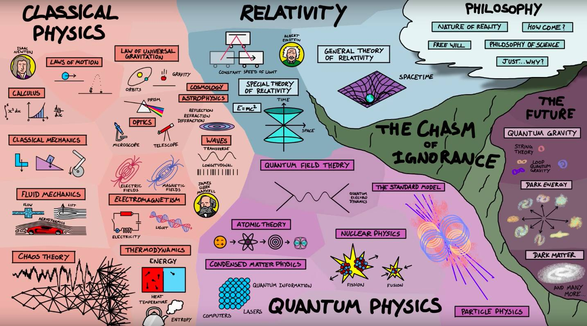
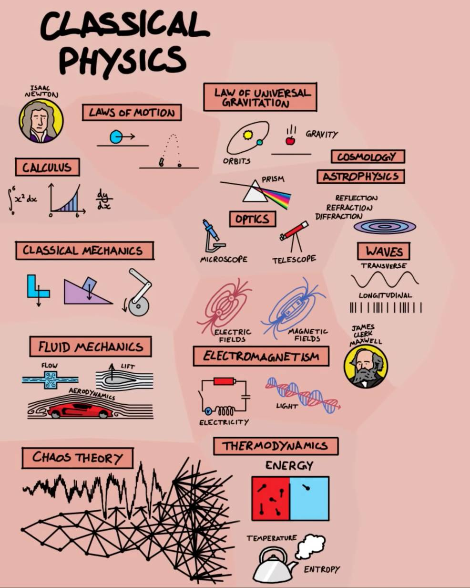
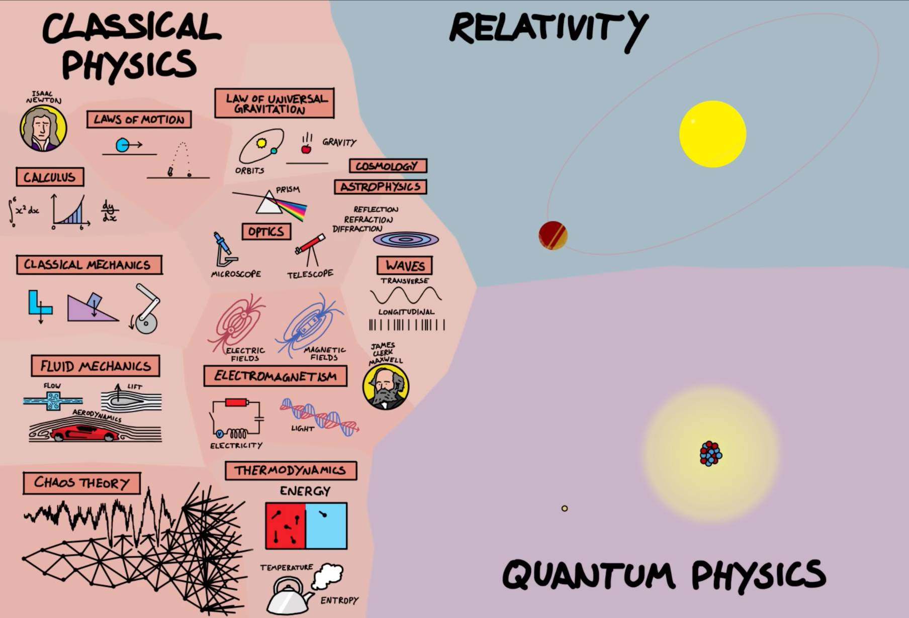
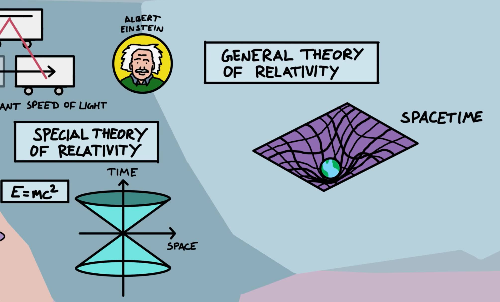
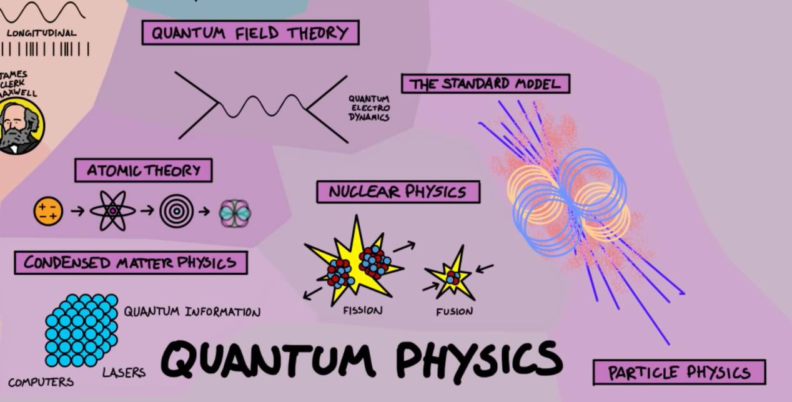
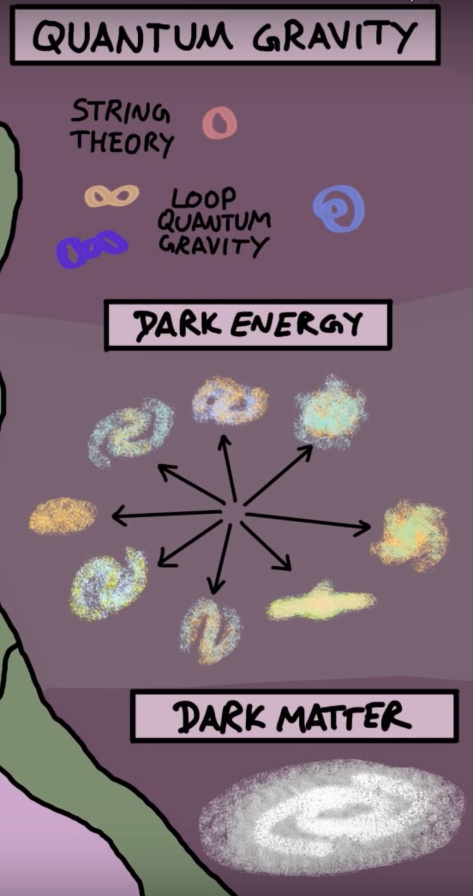

#  The map of physics

[bilibili video](https://www.bilibili.com/video/av9206164?p=2)

**物理**可以简单的被定义为是研究物质和能量的一门科学。但是这个简单的定义其实包含了许多的不同的分支。 **物理学**可以大致被分为三个分支：**经典物理学**、**相对论**和**量子力学**。

## 1 经典物理学 

  

我们从**经典物理**学开始说起, 而这里首先要提到的人物便是**牛顿**。他的**运动定律**描述了万物是如何运动的。他的**万有引力定律**把行星的运动和落在地球的物体优美的联系在一起。 

他也发明了**微积分**，是一个强有力的数学工具，在物理学的各个分支都运用到了微积分。虽然微积分是数学的一个分支，但是数学对物理的重要性却是不言而喻的。 

牛顿还在**光学**领域做出了巨大贡献。光学主要研究光的现象、性质与应用。它解释了在棱镜中看到的折射，以及透镜是如何聚焦光线的，这对于望远镜、显微镜和照相机的制作都很重要。 

望远镜的发明使我们能够更加深入的去探索宇宙，观测在宇宙中不同的天体。这促使了**宇宙学**和**天体物理学**的诞生。 

光学跟波是紧密相连的，**波理论**研究的是能量如何通过媒介的扰动传播的，比如池塘表面的涟漪，或通过空气的声音。光不需要通过任何介质传播，它可以在真空中传播，但也同样服从反射、折射和衍射的原理。这引导我们进入电磁学**。** 

**电磁学**主要研究电磁力，或者说是研究磁场和电场的一个学科。**麦克斯韦**对电磁理论的贡献是里程碑的，他提出了电磁场的方程组，并发现了其实光就是电磁波。电磁学描述了所有的电学现象。

**经典力学**，是以牛顿运动定律为基础。它研究物体是如何运动的，当它们连接在一起的时候会发生什么，比如在齿轮、建筑或桥梁。 

**流体力学**是研究流体（包括液体、气体和等离子体）是如何流动的科学。利用流体力学就可以计算出飞机机翼产生的升力是多少，以及汽车的空气动力学是怎么运作的。流体力学是出了名的难，因为在微观尺度，分子的运动是非常复杂和快速的。而这就需要混沌理论。 

**混沌理论**是对一个巨大的复杂系统的描述。初始状态非常微小的差异是如何导致最后结果的巨大不同。 

**热力学**则是研究热现象中物态转变和能量转换规律的学科。热力学包含了熵的概念，它描述了系统的有序和无序，以及告诉我们不同能量类型有多有用。 

这些就是经典物理学的全部了，在1900年代，我们对宇宙的理解都基于这些物理学分支。在那个时候物理学家认为宇宙中所有东西的运作就像时钟，只要你能够准确的测量，你就能够预测未来。 

但是，并不是所有的问题都得到解决，物理学家在实验/观测中看到了一些无法解释的事情。比如天文学家发现水星环绕太阳的轨道有着牛顿力学无法解释的扰动；同时，在微观尺度，电子和光子也发生了一些怪异的事情。

**物理**学家认为这些问题很快就会得到妥善的解决，而在寻找答案的这个过程中却引来了一场革命——相对论和量子力学的诞生。而两个学科的出现也彻底地改变了我们对宇宙的理解。

## 2 相对论

   

**爱因斯坦**无疑是史上最伟大的科学家之一，他提出了狭义和广义相对论。

**狭义相对论**预言，对于所有的观测者，光速都是不变的。这意味着当你运动的非常快的时候，奇怪的事情开始发生了，比如时间变慢了。

同时，爱因斯坦也将能量和质量通过著名的方程 E=mc^2 联系了起来。 

在相对论中，爱因斯坦将从前认为完全是不同的空间和时间联系在一起，称为时空。

根据**广义相对论**，引力其实就是时空的弯曲。用一句话解释爱因斯坦的引力理就是：“物质告诉时空如何弯曲，时空告诉物质如何运动。” 

相对论是描述宏观世界的理论，而其他**物理**学家则忙于理解对微观尺度的量子世界进行研究。

## 3 量子物理

    

**原子理论**专注于探索原子的本性，原子的结构也逐渐得到了完善，从一个带正负电的小球（梅子布丁模型），到电子绕着原子核运动（卢瑟福模型），到能量等级（玻尔模型），再到电子云（量子力学模型）。 

**凝聚态物理**是研究固体和液体中的原子在一起的量子行为的学科，许多现代高科技都依赖它，比如计算机、激光和量子信息等。

 **核物理**研究原子中的原子核的行为，解释了辐射、在核电站中运用的核裂变，以及在太阳中正在进行的核聚变。物理学家希望在不久的将来能够将在地球上建造核聚变发电站。

 **粒子物理学**则是研究更基本的问题，粒子物理学家在加速器中寻找构成万物的亚原子粒子，或者一些未发现的新离子。目前粒子物理学中最成功的理论被称为“标准模型”。 

**量子场论**是量子力学和狭义相对论相结合的物理理论，被广泛应用在粒子物理学和凝聚态物理学中。这是目前描述宇宙最好的理论。

不幸的是，量子场论并不包括引力。物理学家还不知道怎么将量子物理和广义相对论结合，这就表示我们还有一片未知的鸿沟。

## 4 未来

   

物理学家希望能够找到一个描述所有物理现象的理论，称为**量子引力**，而量子引力可以帮助我们填补这片鸿沟。已经有许物理学家在这条道路上奋斗，他们发展了**弦理**论、**圈量子引力**及其他理论。

但是量子引力并不是我们唯一无法理解的，我们还对构成宇宙95%的**暗物质**和**暗能量**也是一无所知。所有已知的**物理**都只描述了宇宙中的5%，剩下对我们来说是个巨大的谜题。

还有许多其它的未解之谜，比如**大爆炸**，而超过这个我们甚至不知道我们不知道什么。 

## 5 哲学 

虽然有许多物理学家嘲笑哲学，但是有许多大哲学问题促使了物理的发展。比如真实的本性是什么？为什么宇宙会存在？我们有自由意志吗？等等，这些都是大问题，我们或许有或许永远没有答案，但没人任何理由可以阻止我们去寻找答案。 这就是**物理学地图**的全部。

Walliman 想要传达的是关于**物理**学的一个重要事实：当科学家解开一个谜题时，比如运动定律或电磁学，他们的发现往往是打开了新的谜题。例如，经典力学所面临的问题直接导致了相对论和量子力学的诞生。 最后，记住，虽然这张**地图**显示了所有的**物理**学分支。但这或许仅仅只是一张完整**地图**的冰山一角，还有更大的一部分等待着我们去发现。